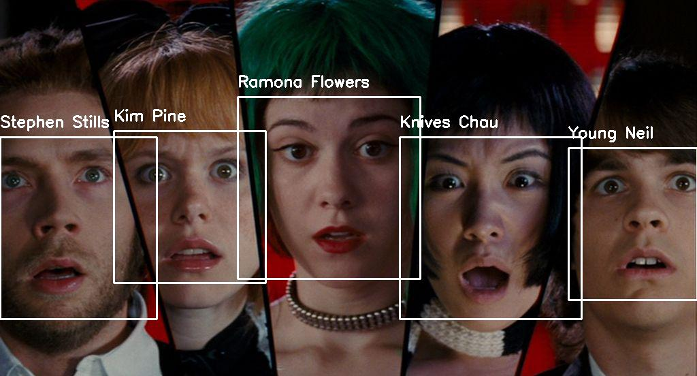
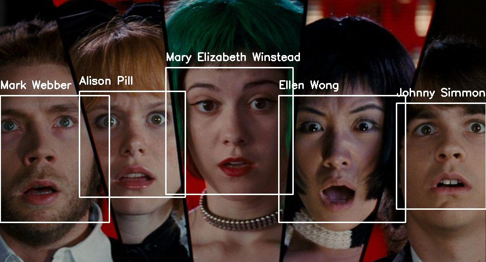
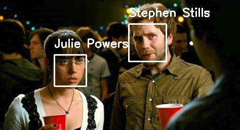
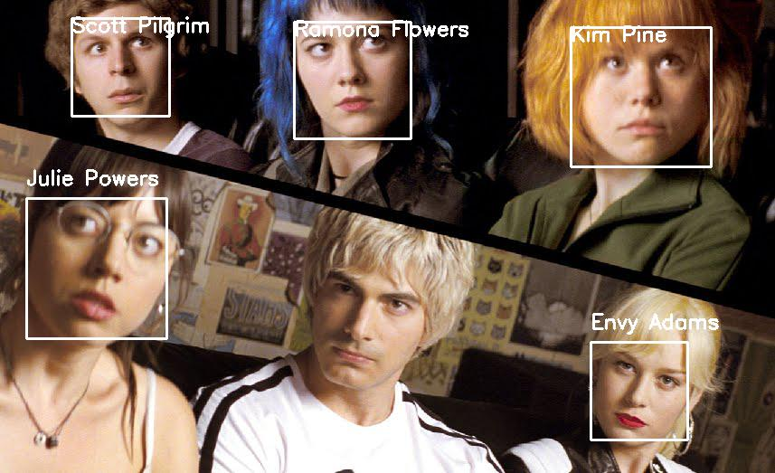
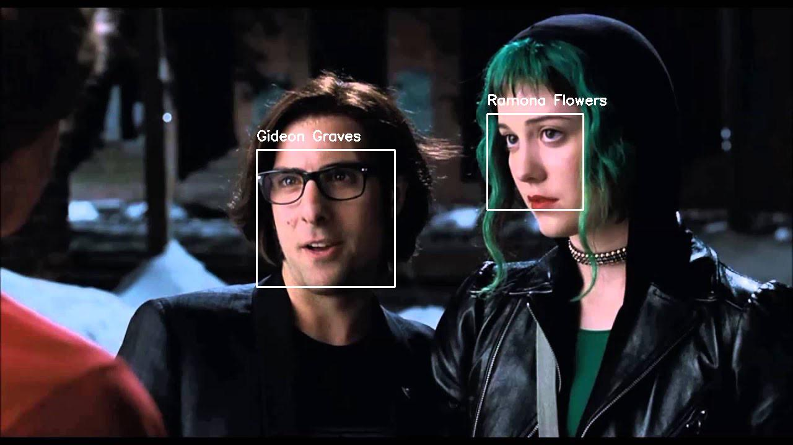
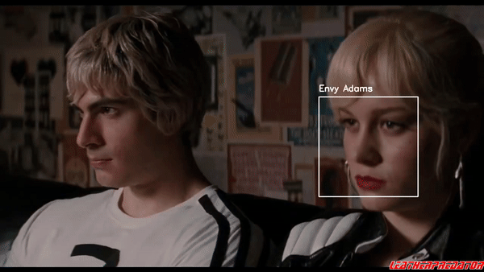

# FaceRecognition


## Description
The objective of this project was to train an algorithm to detect specific faces. The original purpose for this algorithm was to help automate taggin photos in a family album. For this project I used the cast from Scott Pilgrim vs The World as an example to highlight its performance.

## How to Use
### 1. Create a directory for faces. 
The first step is to collect and organize all the photos into folders with the name of the face as the folder name. The more photos of different angles you have the better the algorithm will perform, however, there are limitations with the images being used to train. See #1 and #2 under [Limitation](./README.md#Limitations). 
If you are scraping faces from internet, see `scrape_faces.py` for the simple code I made for this project.

### 2. Train algorithm (create pickles)
The second step is to train the algorithm. This can be seen in the `train_faces.py` script. The module `face_recognition` does all the heavy lifting, since it is already trained to detect faces. Line 43 and Line 47 is where the magic happens.
```
# detect the (x,y)-coordinates of the bounding boxes
# corresponding to each face in the input image
boxes = face_recognition.face_locations(rgb,
                                        model=args["detection_method"])

# compute the facial embedding for the face
encodings = face_recognition.face_encodings(rgb, boxes)
```
Line 43 finds the location of faces from the image provided `rgb`. Then in Line 47 the face encodings are saved to a variable. These encodings are the features that identify a specific face. Each person will have a unique encodings that will slightly vary depending on the angle, lighting, facial expression, etc. The script cycles through each folder, and uses the folder name as the name of the face while it collects the encodings for each image for that folder. The script creates a database of all encodings for each folder(person) and finally saves it as a file (`encodings.pickle`). 

### 3. Apply algorithm to images
When applying the algorithm to new pictures, it uses the saved encodings from the training to see if the new picture matches any encodings from the database. After the training process I made a copy of the encoding.pickle file, and had the actors name in one file (`castEncodings.pickle`) and the characters name in the other (`roleEncoding.pickle`). Below you can see both encodings used, I decided to stick with the roleEncoding for the rest of the project.

|   roleEncodings            |  castEncodings     |
|:-------------------------:|:-------------------------:|
 | 

The `recognize_faces_images.py` script takes a single image and an encodings file as input. It loads the encodings database, extracts the encodings from the new image provided, and compares the new encodings with all the ones in the database. For each name in the database there are multiple encodings, the script goes through each encodings for all the names, if it matches with an encoding, it adds a point (`counts`) to the name that belongs to that encoding. Once it finishes going through all the encodings it uses the name with the largets count as the name for the new encoding.



The script works for images with one face or multiple faces. When the image is processed for the locations and encodings, it grabs the location and encoding for all faces identified. Then for each of the new encodings found it compares with the database.   




 

### 4. Apply algorithm to videos
The `recognize_faces_videos.py` script is similar to the script for images, except it takes in video, and outputs a video with the tagged faces. The script goes through the video frame by frame and applies the algorithm. As the script is going through frame by frame, it saves the frame with the tagged face in the output file. Below are a few "successful" examples. 

 



However, as you see above, the script doesn't work perfectly in all scenarios. With videos its more difficult to have a smoother transition between frames and face locations/encondings. For some videos, the algorithm had difficulty finding faces.


In other videos, it had difficulty maintaining focus on the faces. The boxes would disappear between frames indicating that it had difficulty staying focused. Compare the first part of the first gif below with the image of the same scene above. The image is brighter which might have helped the algorithm see faces better.


## Limitations
1. The algorithm can take up a lot of CPU depending on the size of the photos. Depending on how much your computer can handle, it is recommended that you keep file size below a certain threshold. My laptop could only process images less than 200kB.
2. The training process can take up a long time looking for the faces. It is recommended that you crop your images to just include the faces in order to speed up the process.
3. It works great for images, not so great for videos.
4. Output Video has no audio and fluxuates in speed.

Some more glitchy gif's cause why not.


